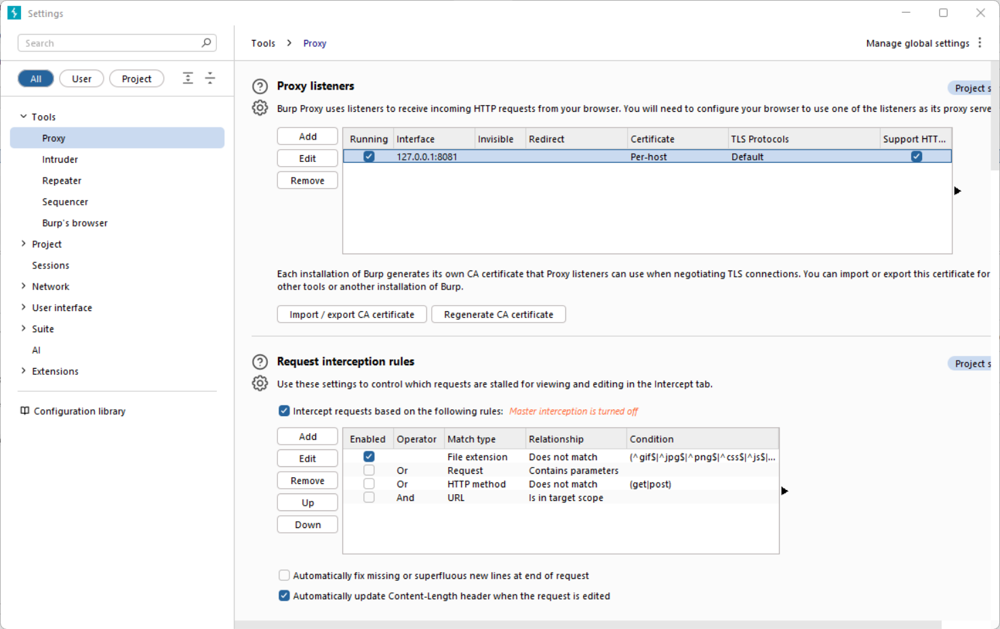
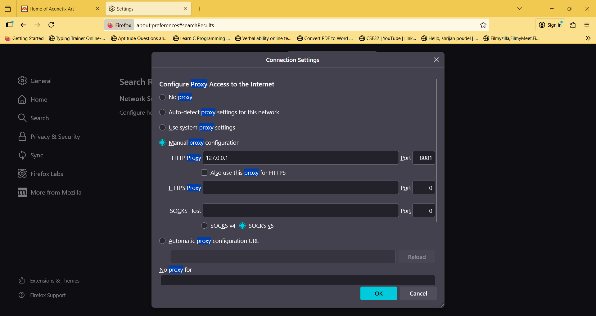
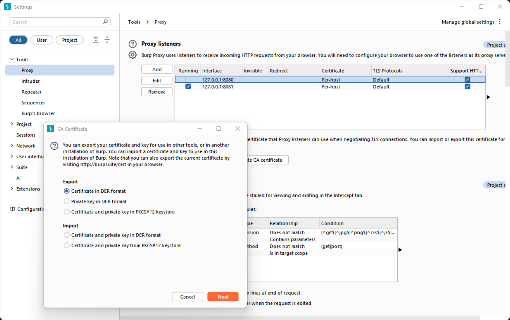
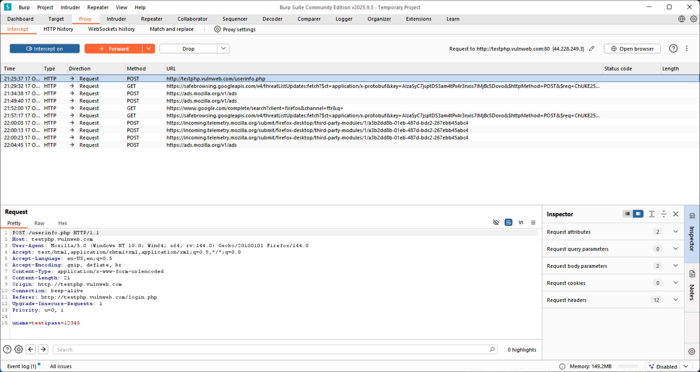
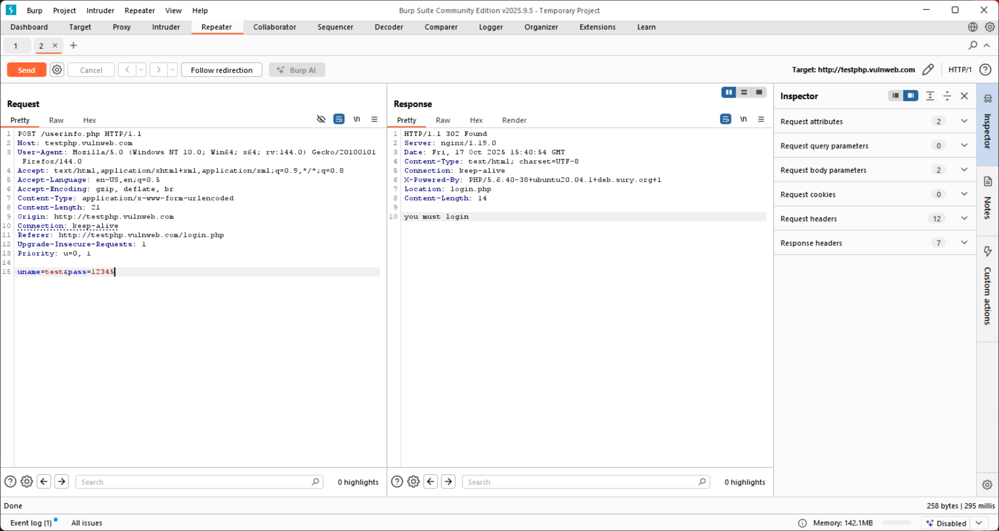
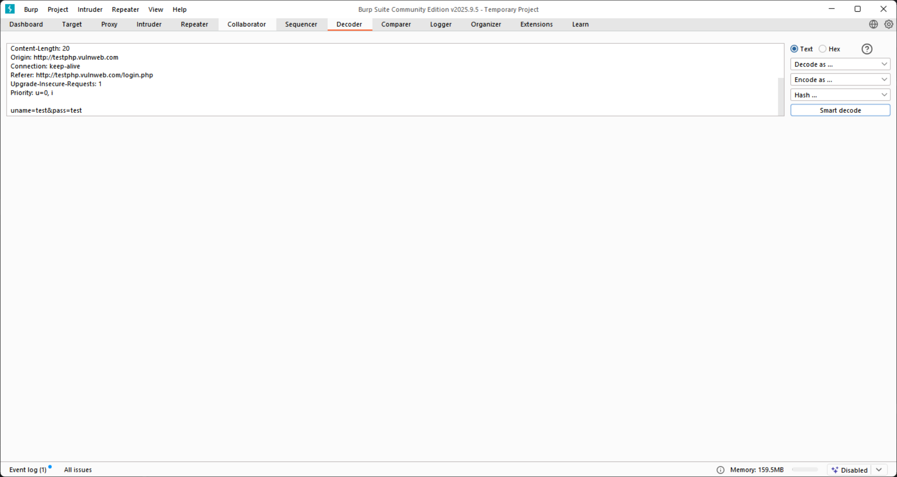
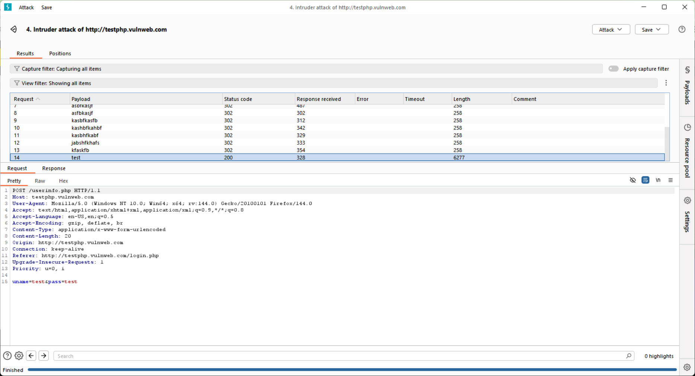
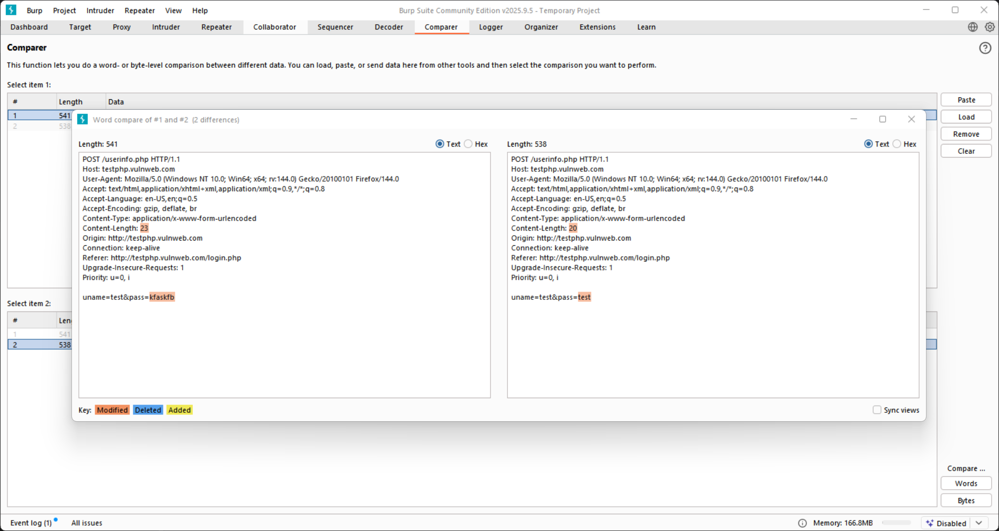

# Web Application Analysis with Burp Suite — Task 2

## Table of Contents

1. [Overview](#overview)
2. [Scope & Ethics](#scope--ethics)
3. [Prerequisites](#prerequisites)
5. [Quick Wordlist](#quick-wordlist)
6. [Step-by-step Workflow (Actionable)](#step-by-step-workflow-actionable)

   * [Setup: Proxy & Certificate](#setup-proxy--certificate)
   * [Intercept a Login Request](#intercept-a-login-request)
   * [Manual Probing with Repeater](#manual-probing-with-repeater)
   * [Decode Encoded Data with Decoder](#decode-encoded-data-with-decoder)
   * [Prepare Intruder: Positions](#prepare-intruder-positions)
   * [Launch Intruder Attack (Sniper)](#launch-intruder-attack-sniper)
   * [Analyze Results](#analyze-results)
   * [Confirm with Comparer](#confirm-with-comparer)


---

## Overview

This document provides a professional, copy-ready guide for performing an end-to-end web application analysis using **Burp Suite Community Edition**. 

---

## Scope & Ethics

All procedures described in this document are intended for **authorized testing only** — use intentionally vulnerable targets (e.g., DVWA, bWAPP, Juice Shop, WebGoat) or systems you own. Unauthorized scanning, brute forcing, or exploitation of third-party systems is illegal and unethical.

---

## Prerequisites

* Burp Suite Community Edition installed (or Burp Pro if available)
* Modern web browser (Firefox recommended for testing)
* Local or lab web application to test (DVWA, bWAPP, WebGoat, Juice Shop, testphp.vulnweb.com)
* Wordlist is created by me on burpsuit 
* Basic familiarity with HTTP concepts and terminal commands

---

## Quick Wordlist (`Simple list`)

Save the following entries (one per line):

```
pass
pass45
pass4
pass1
ksjdfanfs
abhsfjkadbf
asbfkasjf
asfbkasjf
kasbfkasfb
kashbfkahbf
kasbhfkabf
jabshfkhafs
kfaskfb
test
fasn fa
```

---

## Step-by-step Workflow (Actionable)

Each subsection below corresponds to a Burp tool and a concrete set of actions. Perform them in sequence and capture evidence as you go.

### Setup: Proxy & Certificate

1. Open **Burp → Proxy → Options**. Ensure a proxy listener exists on `127.0.0.1` and a chosen port (default `8080`) it will run but in my laptop port 8080 was busy so i used (`port 8081`)
2. Configure your browser to use the HTTP proxy `127.0.0.1:<port>` (no SOCKS). In Firefox: *Settings → Network Settings → Manual proxy configuration*.
3. Install Burp's CA certificate into the browser trust store to avoid HTTPS certificate errors:

      * I have downloaded it from   In Burp: `Proxy →Import or Export CA Certificate .Choose certificate in Der format.And you must write the file name CA`

   * In Burp: `Proxy → Intercept → Open browser` or visit `http://burp` and download `cacert.der`. 
   * Firefox: *Settings → Privacy & Security → Certificates → View Certificates → Import* and trust for website identification.
   

4. Verify connectivity: load `http://testphp.vulnweb.com/` with the proxy enabled — Burp Proxy should capture the request.
## In Burp for  Choosing Http proxy and port


## In FIrefox


## CA Certificate Download



### Intercept a Login Request

1. With **Proxy → Intercept on**, load the login page of your practice target in the proxied browser.
2. Submit credentials and Burp will pause the request. Inspect the request’s method (POST/GET), path, headers, and body.
3. Modify a parameter in the intercepted request and click **Forward**.
4. Observe the browser response — look for redirects, different HTML, or new `Set-Cookie` headers.




### Manual Probing with Repeater

1. In **Proxy → HTTP history**, locate the captured login request, right-click → **Send to Repeater**.
2. In Repeater, iteratively modify the request and click **Send** to observe raw responses.
3. Common probes:
   * 302 not found which is common

   * SQLi test: `password='` or `password=' OR '1'='1`.
   * Boundary tests: empty password, extremely long input, special characters.
4. Note differences in status codes, response bodies, redirects, and Set-Cookie headers.




### Decode Encoded Data with Decoder

1. If a parameter or header appears encoded (Base64, URL-encoding, hex), select it and **Send to Decoder**.
2. Use Decoder to stepwise decode until plaintext appears. Modify as needed and re-encode before sending the crafted value back to Repeater.
3. Example: decode `dXNlcj1hZG1pbg==` → `user=admin` → modify → re-encode.

`As there was nothing in my website to decode but also for practice i did it to understand how it runs`


### Prepare Intruder: Positions

1. From Repeater or HTTP history, right-click the request → **Send to Intruder**.
2. Intruder → **Positions**: click **Clear §** to remove default markers.
3. Highlight only the value of the target parameter (e.g., password) and click **Add §**.
4. Ensure CSRF tokens or cookies are not marked as payload positions unless intentional.

### Launch Intruder Attack (Sniper)

1. In Positions, set **Attack type** to **Sniper**.
2. Open **Payloads** → Simple list.Add your own play list or you can download password or username file from website too 
3. If necessary, configure payload processors (e.g., URL-encode).
4. Click **Start attack**. (Community edition is single-threaded — expect a slower run; keep lists small.)




### Analyze Results

1. In Intruder results, sort by the **Length** column to find outliers.
2. Check status codes, `Location` headers, and `Set-Cookie` differences.
3. Right-click any suspicious row → **Send to Repeater** for deeper manual inspection.


### Confirm with Comparer

1. From Repeater or Intruder results, select one clearly failed response and one suspected-successful response → **Send to Comparer**.
2. In **Comparer**, perform a **Words** or **Lines** comparison to highlight differences (e.g., presence of "Welcome, <user>", `Logout` link, or different HTML structures).
3. Reproduce the suspected successful request in the browser or Repeater and capture screenshot evidence (redact sensitive tokens before saving).




---


